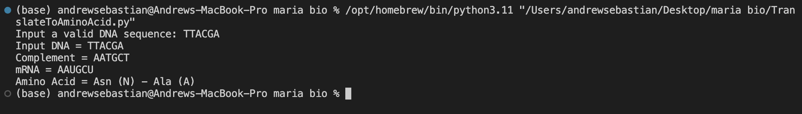
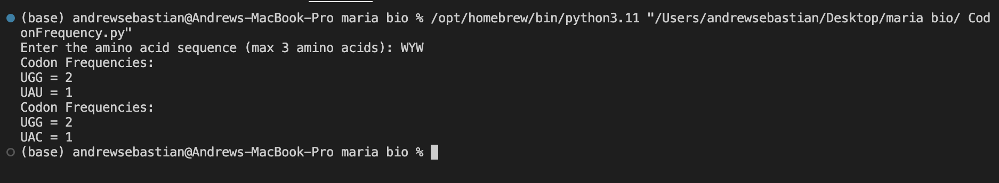

# ComputationalBioAssignment1

## 1. Translation of DNA Sequence to Amino Acid (`translate.jpg`)

### Task:
Translate a DNA sequence to mRNA (using 'U' instead of 'T'), then into an amino acid sequence.

### Example:
- **Input DNA:** `TTACGA`
- **Complement:** `AATGCT`
- **mRNA:** `AAUGCU`
- **Amino Acids:** Asn (N) - Ala (A)

---

## 2. Frequency of RNA Codons for a Given Amino Acid (`frequency.jpg`)

### Task:
Find the frequency of each RNA codon encoding a given amino acid from a DNA sequence.

### Example:
- **Input Amino Acids:** W (Tryptophan), Y (Tyrosine), W (Tryptophan)
- **mRNA:** `UGGUACUGG`
- **Codon Counts:**  
  - UGG = 2 (Tryptophan)  
  - UAC = 1 (Tyrosine)

